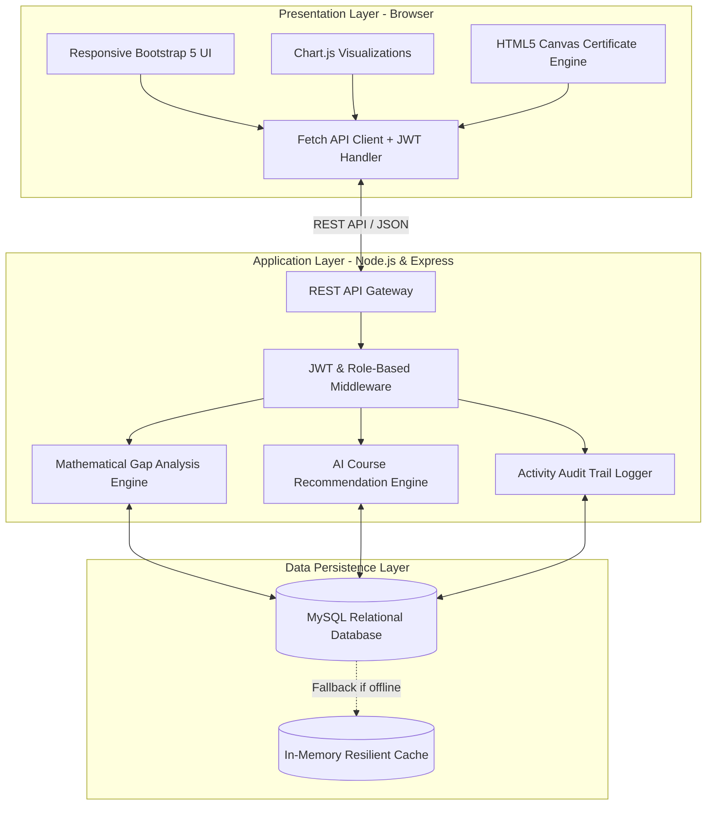
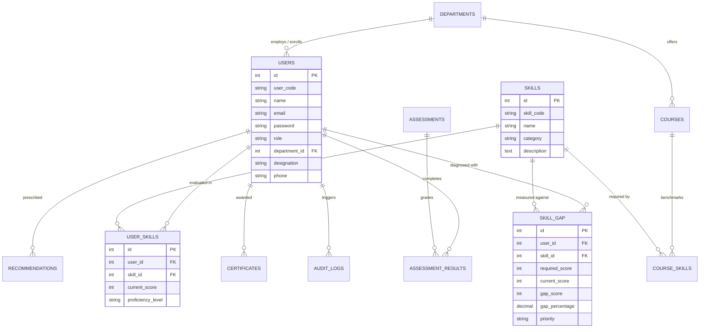

# 🎯 Skill_Map: Skill Mapping & Gap Analysis System

[](https://nodejs.org/)
[](https://expressjs.com/)
[](https://www.mysql.com/)
[](https://getbootstrap.com/)
[](https://www.chartjs.org/)
[](https://jwt.io/)
[](LICENSE)

---

## 🌟 Executive Overview

**Skill_Map** is an enterprise-grade **Skill Intelligence & Competency Mapping Platform** designed for universities, technical academies, corporate HR departments, and large enterprises. It systematically identifies disparities between current employee/student competencies and industry-demanded skill benchmarks, calculates mathematical skill gaps, and prescribes tailored AI-driven learning pathways.

The system bridges the critical gap between academic learning and enterprise readiness through multi-role governance, interactive proficiency matrices, radar analytics, and verifiable dynamic digital credentials.

---

## 🚀 Key Features

- 🛡️ **Role-Based Access Control (RBAC)**: Custom operational dashboards for 5 distinct roles: **Admin**, **Faculty**, **Student**, **HR Manager**, and **Training Manager**.
- 📊 **Dynamic Skill Mapping & Heatmap**: 
  - Multi-dimensional matrix mapping individuals against curated skill taxonomies.
  - 4-Tier Proficiency Level Classification: `Beginner` (0-49%), `Intermediate` (50-69%), `Advanced` (70-84%), and `Expert` (85-100%).
- 🎯 **Mathematical Skill Gap Engine**:
  - Precision computation:
    $$\text{Gap Score} = \text{Required Benchmark Score} - \text{Current Evaluated Score}$$
    $$\text{Gap Percentage} = \left( \frac{\text{Gap Score}}{\text{Required Score}} \right) \times 100$$
  - Automated severity classification:
    - 🔴 **Critical Priority**: $\ge 50\%$ deficit
    - 🟡 **Medium Priority**: $25\% - 49\%$ deficit
    - 🟢 **Low Priority**: $< 25\%$ deficit
- 💡 **Automated Learning Pathway Generator**: Matches identified competency deficits to curated learning modules, workshops, certifications, and reading resources.
- 📈 **Real-Time Visual Analytics**:
  - Interactive multi-axis Radar Charts for individual & departmental competency mapping.
  - Departmental benchmarking bar charts and category distribution visualizers via **Chart.js 4**.
- 📜 **Cryptographic Certificate Engine**: Real-time HTML5 Canvas certificate generation with SHA-256 verification hashes and direct PDF printing.
- 📁 **Enterprise Reporting & Export**: On-the-fly export of talent matrices, gap assessments, and audit logs to **Excel**, **CSV**, and **Print-Ready PDF**.
- 🔒 **Security & Auditability**:
  - JWT stateless session authentication and Bcrypt salt hashing.
  - Complete compliance audit trail logging system activities and score modifications.
  - Zero sensitive secrets exposed via `.env.example` and strict `.gitignore` rules.
  - Built-in resilient in-memory database fallback to ensure zero-downtime demonstration.

---

## 📐 Architecture & System Design

### High-Level System Architecture



---

### Entity-Relationship Diagram (ERD)



---

## 🔑 Default Demonstration Accounts

The platform includes pre-configured sandbox demo accounts representing every RBAC tier. You can click on any role on the login portal to auto-fill these credentials:

| Role | Demo Email | Demo Password | Core Responsibilities & Privileges |
|:---|:---|:---|:---|
| **Admin** | `admin@skillmap.com` | `admin123` | Full system administration, user management, audit logs, global settings & DB backups. |
| **Faculty** | `faculty@skillmap.com` | `faculty123` | Curriculum skill benchmarking, grading assessments, managing student cohorts. |
| **Student** | `student@skillmap.com` | `student123` | Taking assessments, reviewing personalized skill gap analyses, following learning pathways. |
| **HR Manager** | `hr@skillmap.com` | `hr123` | Employee competency matrix analysis, talent benchmarking, ROI & departmental gap reporting. |
| **Training Manager** | `training@skillmap.com` | `training123` | Designing enterprise training modules, assigning courses, tracking certificate completions. |

---

## 🛠️ Technology Stack

| Layer | Technologies |
|:---|:---|
| **Frontend UI** | HTML5, Modern Vanilla CSS3, Glassmorphism UI tokens, Bootstrap 5.3, Bootstrap Icons |
| **Frontend Scripting** | Vanilla JavaScript (ES6+ modular controllers: `api.js`, `auth.js`, `dashboard.js`, `gap-analysis.js`) |
| **Data Visualization** | Chart.js 4.4 (Radar, Bar, Doughnut, Line charts) |
| **Modals & UI Alerts** | SweetAlert2 |
| **Backend Runtime** | Node.js (v18+) & Express.js |
| **Database** | MySQL 8.0+ / MariaDB (with connection pooling via `mysql2/promise`) |
| **Fallback Engine** | Resilient in-memory database store (zero dependency mode for offline demos) |
| **Security & Auth** | JSON Web Tokens (`jsonwebtoken`), Bcrypt password hashing (`bcryptjs`), CORS |
| **File Handling** | Multer (Profile avatars, CSV bulk user imports) |

---

## 📁 Repository Structure

```
Skill_Map/
├── .gitignore                      # Excludes node_modules, .env, and sensitive files
├── README.md                       # Comprehensive platform documentation
├── install_dependencies.bat        # Windows one-click automated dependency installer
├── start_server.bat                # Windows one-click automated server launcher
│
├── client/                         # Frontend presentation layer
│   ├── assets/
│   │   ├── css/
│   │   │   ├── main.css            # Corporate design system tokens & glassmorphism
│   │   │   └── dashboard.css       # Layout rules for sidebar, topbar & analytics cards
│   │   └── js/
│   │       ├── api.js              # Centralized Fetch client with JWT authorization headers
│   │       ├── auth.js             # Session management, authentication & route guard
│   │       ├── dashboard.js        # KPI cards binder & Chart.js instances
│   │       ├── gap-analysis.js     # Gap analysis calculation UI & radar chart binder
│   │       ├── skills.js           # Skills catalog & matrix controller
│   │       ├── recommendations.js  # Learning pathway recommendations controller
│   │       ├── certificates.js     # Dynamic HTML5 canvas certificate generator
│   │       ├── reports.js          # PDF & Excel export controllers
│   │       ├── users.js            # User management controller
│   │       └── theme.js            # Dark/light theme & sidebar state controller
│   ├── components/
│   │   ├── navbar.html             # Global navigation bar component
│   │   ├── sidebar.html            # Role-aware sidebar navigation component
│   │   └── footer.html             # Global footer component
│   ├── pages/                      # Specific feature views
│   │   ├── assessments.html        # Skill assessment testing portal
│   │   ├── audit-logs.html         # System activity logs & compliance trails
│   │   ├── certificates.html       # Certificate issuance & verification
│   │   ├── courses.html            # Training course catalog & benchmark management
│   │   ├── departments.html        # Department management & faculty assignments
│   │   ├── gap-analysis.html       # Individual & cohort gap analysis views
│   │   ├── leaderboard.html        # Top talent leaderboard & competency rankings
│   │   ├── learning-plans.html     # Custom learning milestone paths
│   │   ├── notifications.html      # User notifications hub
│   │   ├── recommendations.html    # AI training course recommendations
│   │   ├── reports.html            # Analytical reports & export hub
│   │   ├── settings.html           # Account security & system settings
│   │   ├── skill-mapping.html      # Interactive Skill-to-Role mapping matrix
│   │   ├── skills.html             # Master skill catalog management
│   │   └── users.html              # Multi-role user directory
│   ├── dashboard.html              # Main role-specific analytical hub
│   ├── index.html                  # Public platform landing showcase
│   ├── login.html                  # Authentication portal with quick demo selector
│   └── register.html               # New user onboarding registration portal
│
├── server/                         # Backend Express application
│   ├── config/
│   │   ├── db.js                   # MySQL connection pool & resilient fallback store
│   │   └── jwt.js                  # JWT token generator & verification utility
│   ├── controllers/                # REST API business logic controllers
│   │   ├── analyticsController.js
│   │   ├── assessmentController.js
│   │   ├── authController.js
│   │   ├── courseController.js
│   │   ├── departmentController.js
│   │   ├── gapController.js
│   │   ├── mappingController.js
│   │   ├── notificationController.js
│   │   ├── recommendationController.js
│   │   ├── reportController.js
│   │   ├── settingsController.js
│   │   ├── skillController.js
│   │   └── userController.js
│   ├── middleware/
│   │   ├── authMiddleware.js       # JWT validation guard
│   │   ├── roleMiddleware.js       # RBAC permission check middleware
│   │   ├── uploadMiddleware.js     # Multer file upload configuration
│   │   └── errorHandler.js         # Centralized error handler
│   ├── routes/                     # Express REST API endpoints
│   ├── utils/
│   │   ├── gapEngine.js            # Algorithmic gap calculation utilities
│   │   ├── recommendationEngine.js # Course recommendation matching logic
│   │   └── logger.js               # Activity logger
│   ├── uploads/
│   │   └── .gitkeep                # Git tracking placeholder for upload directory
│   ├── .env.example                # Safe environment variable configuration template
│   ├── app.js                      # Express application entrypoint
│   └── package.json                # Dependencies and server scripts
│
└── database/
    └── skill_map.sql               # Complete SQL schema & 125+ seed records
```

---

## 📡 REST API Reference

| Method | Endpoint | Description | Access |
|:---|:---|:---|:---|
| `POST` | `/api/auth/login` | Authenticate user & receive JWT token | Public |
| `POST` | `/api/auth/register` | Register new student or employee account | Public |
| `GET` | `/api/auth/profile` | Retrieve authenticated user profile | Authenticated |
| `GET` | `/api/skills` | List all skills in catalog | Authenticated |
| `POST` | `/api/skills` | Create new skill definition | Admin / Faculty |
| `GET` | `/api/gap/user/:id` | Calculate skill gap metrics for a specific user | Authenticated |
| `GET` | `/api/gap/department/:id` | Departmental aggregate skill gap report | HR / Admin |
| `GET` | `/api/recommendations/user/:id`| Generate targeted course recommendations | Authenticated |
| `GET` | `/api/analytics/dashboard` | Dashboard KPI stats & Chart.js data packages | Authenticated |
| `GET` | `/api/reports/export/:type`| Export reports in CSV, PDF, or Excel | HR / Admin / Faculty |
| `GET` | `/api/audit-logs` | Retrieve chronological security audit trail | Admin |

---

## ⚡ Quick Start Installation Guide

### Prerequisites
- [Node.js](https://nodejs.org/) (Version 18.x or higher)
- [MySQL](https://www.mysql.com/) (Version 8.0+) or [XAMPP](https://www.apachefriends.org/) (with Apache & MySQL)
- Git installed on your system

---

### Method 1: One-Click Setup (Windows)

1. **Clone this repository**:
   ```bash
   git clone https://github.com/Tanmaybhar7/Skill_Map_And_Gap_Analysis_system.git
   cd Skill_Map_And_Gap_Analysis_system
   ```

2. **Install Dependencies**:
   - Double-click **`install_dependencies.bat`**. This will automatically run `npm install` inside the `server/` directory.

3. **Start the Application**:
   - Double-click **`start_server.bat`**. The server will boot on `http://localhost:5000`.

---

### Method 2: Manual Terminal / PowerShell Setup

#### 1. Configure the Database (Optional but Recommended)
1. Launch **XAMPP Control Panel** and start **MySQL**.
2. Open phpMyAdmin (`http://localhost/phpmyadmin`) or your MySQL client.
3. Create a database named `skill_map` and import the schema:
   ```bash
   mysql -u root -p skill_map < database/skill_map.sql
   ```
   *(Note: If MySQL is not running, the system automatically falls back to its built-in in-memory dataset, ensuring zero setup friction.)*

#### 2. Configure Environment Variables
Inside the `server/` directory, copy `.env.example` to create `.env`:
```powershell
cp server/.env.example server/.env
```
Edit `server/.env` if you have customized your local MySQL password or port:
```env
PORT=5000
NODE_ENV=development
DB_HOST=localhost
DB_USER=root
DB_PASS=
DB_NAME=skill_map
DB_PORT=3306
JWT_SECRET=your_jwt_secret_key_here
JWT_EXPIRES_IN=24h
```

#### 3. Install Server Dependencies & Run
```powershell
cd server
npm install
node app.js
```
*(Or use `npm run dev` for auto-reloading during development.)*

#### 4. Access the Web Application
Open your browser and navigate to:
```
http://localhost:5000
```
- Click **"View Demo Accounts"** on the landing page or use the role tabs on `/login.html` to instantly explore any role!

---

## 🔒 Security & Privacy Notice

- **No Hardcoded Secrets**: Production secrets and database credentials are excluded from source control using `.gitignore` and `.env.example`.
- **Stateless Tokens**: Authentication uses digitally signed JSON Web Tokens (JWT) with configurable expiry.
- **Password Salting**: Passwords stored in MySQL utilize one-way Bcrypt hashing with cost factor 10.
- **Audit Trails**: Sensitive actions (role changes, grading, password updates) create immutable audit logs.

---

## 👨‍💻 Author & Acknowledgements

- **Developer**: [Tanmay Bhar](https://github.com/Tanmaybhar7)
- **Project**: Skill Mapping & Gap Analysis Intelligence Platform (Final Year Project)

---

## 📄 License

This project is licensed under the **MIT License** — feel free to use, customize, and extend it for academic and enterprise purposes.
